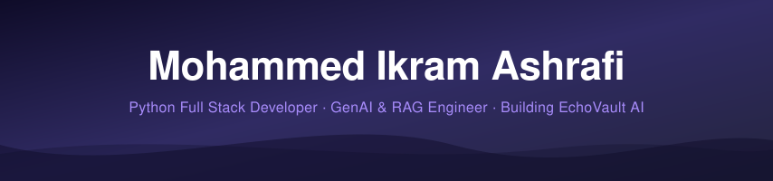

<div align="center">

<!-- Animated Banner — self-hosted SVG, always loads reliably -->


<!-- Typing Animation -->
<a href="https://git.io/typing-svg">
  
</a>

<br/>

<!-- Social Badges -->
[](https://www.mohammed-ikram-ashrafi.in/)
[](https://echovaultai.me)
[](https://www.linkedin.com/in/mohammed-ikram-ashrafi/)
[](mailto:ikramshariff2005@gmail.com)

<br/>

<!-- Profile Views + Followers -->

[](https://github.com/miashraf1818)

</div>

---


## 🧠 Who Am I?

```python
class MohammedIkram:
    role       = "Python Full Stack Developer & GenAI Engineer"
    stack      = "Python · FastAPI · Django · LangChain · RAG"
    mission    = "Build privacy-first memory intelligence"
    currently  = "EchoVault AI 🧠"
    philosophy = "A companion, not a clone."

    skills = {
        "AI/ML"    : ["RAG", "LangChain", "Vector DBs", "Llama"],
        "Backend"  : ["FastAPI", "Django", "Flask", "Async Python"],
        "Cloud"    : ["AWS EC2", "Docker", "Nginx", "GitHub Actions"],
        "Databases": ["PostgreSQL", "MongoDB", "Pinecone"],
        "Frontend" : ["React", "Next.js", "Tailwind CSS"],
    }

    def current_focus(self):
        return "Emotional Memory Retrieval Systems 🔮"
```

<br clear="right"/>

---

## 🚀 Flagship Project — EchoVault AI

<div align="center">

```
╔══════════════════════════════════════════════════════════╗
║           🧠  E C H O V A U L T   A I                   ║
║   Privacy-First Emotional Memory Intelligence System     ║
╠══════════════════════════════════════════════════════════╣
║  📖 Converts conversations → searchable memory          ║
║  🎙️ Voice + journal ingestion pipeline                  ║
║  🔍 Semantic & emotional context retrieval              ║
║  🔐 Secure encrypted vault architecture                 ║
║  📈 AI reflection & timeline analysis engine            ║
╠══════════════════════════════════════════════════════════╣
║        > "A companion, not a clone."                    ║
╚══════════════════════════════════════════════════════════╝
```

[](https://echovaultai.me)

</div>

---

## ⚙️ Tech Arsenal

<div align="center">

### 🐍 Backend & APIs


### 🧠 AI / GenAI Stack


### ☁️ Cloud & DevOps


### 🗄️ Databases


### 🎨 Frontend


</div>

---

## 📊 GitHub Stats

<div align="center">


</div>

<div align="center">
  
</div>

<div align="center">
  
</div>

---

## 🌱 Currently Leveling Up

<div align="center">

| 🎯 Area | 📈 Progress |
|---|---|
| Advanced RAG Optimization | `████████░░` 80% |
| AI Infrastructure Engineering | `███████░░░` 70% |
| Distributed Backend Systems | `██████░░░░` 60% |
| AWS Cloud Architecture | `█████░░░░░` 50% |
| High-Performance Async Python | `████████░░` 80% |

</div>

---

## 💡 Philosophy

<div align="center">

> *"I'm interested in building AI systems that **augment human memory and understanding** — not replace human identity."*

| 🛡️ Ethical AI | 🔒 Privacy-First | 📐 Scalable Infra | 🫂 Human-Centered |
|:---:|:---:|:---:|:---:|
| Building responsibly | Zero surveillance | Long-term architecture | AI for humans |

</div>

---

## 🤝 Connect With Me

<div align="center">

[](https://www.linkedin.com/in/mohammed-ikram-ashrafi/)
[](https://www.mohammed-ikram-ashrafi.in/)
[](mailto:ikramshariff2005@gmail.com)

<br/>

*"Building the future of ethical memory retrieval systems — one commit at a time."* 🚀

</div>

<!-- Footer Wave — inline SVG, no external dependency -->
<svg width="100%" height="80" viewBox="0 0 900 80" xmlns="http://www.w3.org/2000/svg" preserveAspectRatio="none">
  <defs>
    <linearGradient id="footerGrad" x1="0%" y1="0%" x2="100%" y2="0%">
      <stop offset="0%" stop-color="#24243e"/>
      <stop offset="50%" stop-color="#302b63"/>
      <stop offset="100%" stop-color="#0f0c29"/>
    </linearGradient>
  </defs>
  <path d="M0,20 C150,55 300,5 450,30 C600,55 750,10 900,35 L900,80 L0,80 Z" fill="url(#footerGrad)"/>
  <path d="M0,35 C200,65 400,15 600,40 C750,58 850,25 900,45 L900,80 L0,80 Z" fill="#7c3aed" opacity="0.25"/>
</svg>

